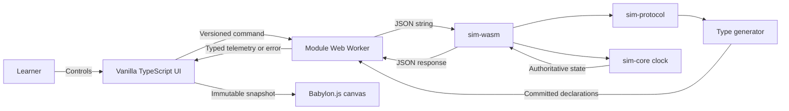

# Approved Design

<!-- Confirmed during the /cip interview on 2026-09-11. -->

## Components and boundaries

- **Rust workspace**
  - `sim-protocol`: Serde-compatible tagged protocol v1 and Rust-derived TypeScript declarations.
  - `sim-core`: deterministic fixed-tick clock and command state transitions.
  - `sim-wasm`: thin `wasm-bindgen` adapter that exchanges JSON strings and owns no simulation policy.
- **Web workspace**
  - a module Web Worker initializes the WASM package, owns its sole stateful instance and timer, queues one
    explicit tick per timer callback without catch-up, routes correlated requests, and emits ready/failed
    transport events;
  - a vanilla TypeScript worker client translates generated protocol types into an observable UI model;
    it owns starting/stopped state, rejects pending requests during disposal, removes handlers, cancels the
    scheduler through worker termination, and never restarts implicitly;
  - Babylon.js owns a minimal live canvas, while standard DOM controls expose lifecycle, tick/time,
    pause/resume, step, reset, and errors;
  - a collapsed-by-default diagnostics panel sends one intentionally unsupported raw envelope through the
    real worker boundary and displays its request, typed error, correlation, and unchanged clock state.
- **Local quality gate**
  - root commands orchestrate Rust formatting/lint/tests, TypeScript type checks/tests, protocol drift
    checks, production build, and Playwright Chromium tests;
  - no GitHub Actions or hosted-runner configuration belongs to this plan.
- **Learning material**
  - one executable chapter explains the boundaries, tradeoffs, Rust concepts, diagrams, and expected
    pause/step/reset observations;
  - `exercises/01-executable-foundation/` contains 3–6 prerequisite-ordered debugger tours and reversible
    experiments against the working implementation;
  - repository `.vscode/extensions.json`, `.vscode/launch.json`, and `.vscode/tasks.json` recommend
    rust-analyzer and CodeLLDB and provide named native Rust-test and Chromium/TypeScript debug entry points;
  - native Rust breakpoints and Chromium main-thread/worker TypeScript debugging are supported. Rust-in-WASM
    source breakpoints are out of scope unless locally demonstrated;
  - exercise instructions identify stable breakpoint locations because line breakpoints are user state.

## Program flow



## Optional call stacks

The request sequence clarifies correlation, authority, and error behavior:

```mermaid
sequenceDiagram
    participant UI as Main-thread UI
    participant W as Module Worker
    participant A as Rust WASM adapter
    participant C as Rust clock core
    UI->>W: protocol-v1 command + request ID
    W->>A: serialized JSON
    A->>C: validated state transition
    alt valid command
        C-->>A: immutable clock state
        A-->>W: correlated telemetry JSON
        W-->>UI: typed telemetry
    else malformed or unsupported command
        A-->>W: typed error; state unchanged
        W-->>UI: visible correlated error
    end
```

While running, the worker queues one explicit tick event per timer callback through the same serialized
dispatch path. Timer delay slows simulated time rather than creating catch-up bursts. Disposal terminates
the worker, after which the client enters stopped state and rejects pending requests with transport errors.
