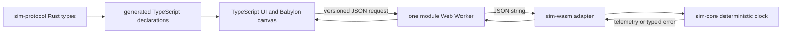
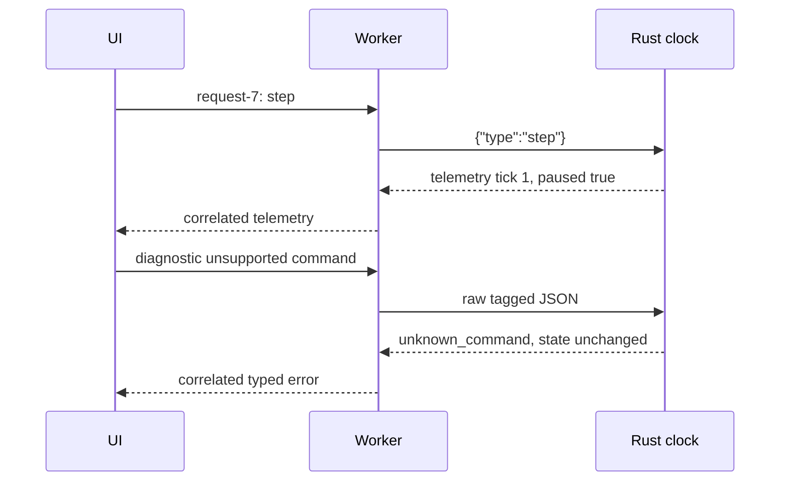

# 01: Executable foundation

This chapter builds the smallest useful simulator seam: a clock that advances only when Rust accepts a
fixed tick. It is a learning scaffold, not a flight model, virtual drone, or physical-drone-ready
controller.

## Setup

Follow [local development](../local-development.md), then install the local test browser once:

```powershell
npx playwright install chromium
npm ci
npm run build:wasm
npm run dev
```

Open the displayed `http://127.0.0.1:4173` address. The supported evidence is Windows plus this
Playwright Chromium build. Linux, macOS, Firefox, WebKit, performance tuning, and Rust-in-WASM source
breakpoints are deliberately deferred.

## Architecture



`sim-protocol` owns the application schema, `sim-core` owns the clock transitions, and `sim-wasm`
only translates strings at the language boundary. This small set of crates is intentionally less
flexible than a generic simulation framework; it is easier to inspect, test, and extend after a
real requirement appears.

## Request sequence



The request ID is not clock state: it lets the UI match a response to the request that caused it.
Lifecycle messages such as `ready` and `failed` are TypeScript transport details, not Rust protocol
messages.

## Rust concepts in the code

`SimClock` in `sim-core::SimClock::execute` owns its fields. Its `&mut self` receiver is Rust’s
exclusive mutable borrow: while a transition is running, no other code can mutate the same clock
through that reference. `Telemetry` is returned as a new value, so the UI receives a snapshot rather
than a reference into clock state.

Crate boundaries make this visible. `sim-core` depends on `sim-protocol` but has no browser imports;
`sim-wasm::Simulation::dispatch` owns the browser-facing JSON-string ABI; TypeScript has generated
declarations, not a separately maintained copy of protocol fields. Unsigned 64-bit clock values
serialize as strings, preserving their full range across JSON and JavaScript.

## Worker and rendering time

`WorkerRuntime` owns one `setInterval`. Each callback enqueues **one** `inject_tick`; delayed JavaScript
does not add catch-up ticks. A pause response clears future callbacks, and disposal terminates the
worker and rejects pending client requests immediately. Commands and ticks use one promise queue, so
arrival order is preserved.

Babylon’s render loop may draw many frames, few frames, or no frames without advancing simulation time.
It only displays immutable telemetry. The tradeoff is intentional: the toy clock can lag wall time,
but its behavior remains deterministic and does not gain a second UI-side clock.

## Run the experiment

1. With the page open, observe **Transport: ready**, `Tick: 0`, and the collapsed **Learner diagnostics**
   panel.
2. Select **Step once**. Predict that the display becomes tick `1`, time `100000 us`, while **Resume**
   stays available. This proves a step advances exactly one fixed Rust tick while paused.
3. Select **Resume**, watch the tick rise, then select **Pause**. Predict that it stops rising; rendering
   remains active but no longer changes simulation time.
4. Select **Reset**. Predict exactly `Tick: 0 | Simulation time: 0 us` and a paused clock.
5. Expand diagnostics and select **Send unsupported envelope**. Predict `unknown_command`, a
   `diagnostic-...` correlation ID, and equal before/after ticks.

If the worker remains `starting`, run `npm run build:wasm` and refresh. If Chromium is unavailable,
run `npx playwright install chromium`. If native compilation cannot find `link.exe`, install the
documented Visual Studio C++ Build Tools workload.

## Next learning steps

Work through the [foundation exercise pack](../../exercises/01-executable-foundation/README.md) for
debugger-guided observation and reversible experiments. The next simulator milestone adds dynamics;
do not infer physical accuracy, sensors, controls, or safety properties from this foundation.
